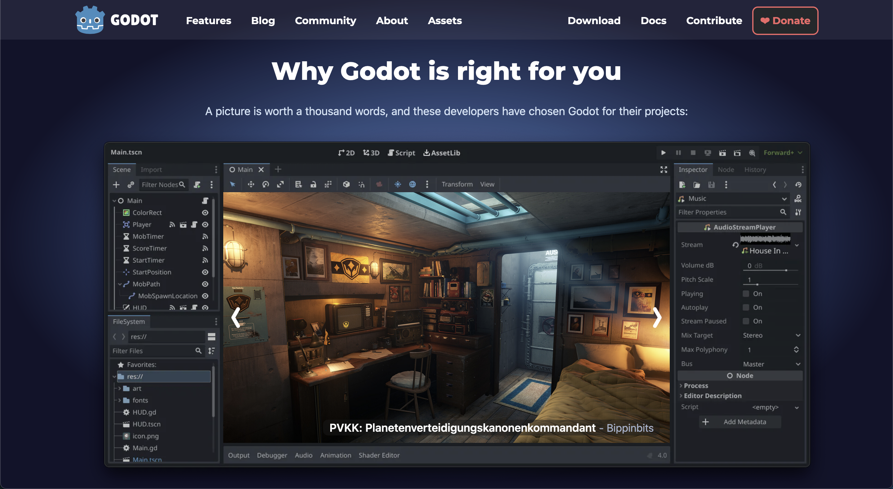
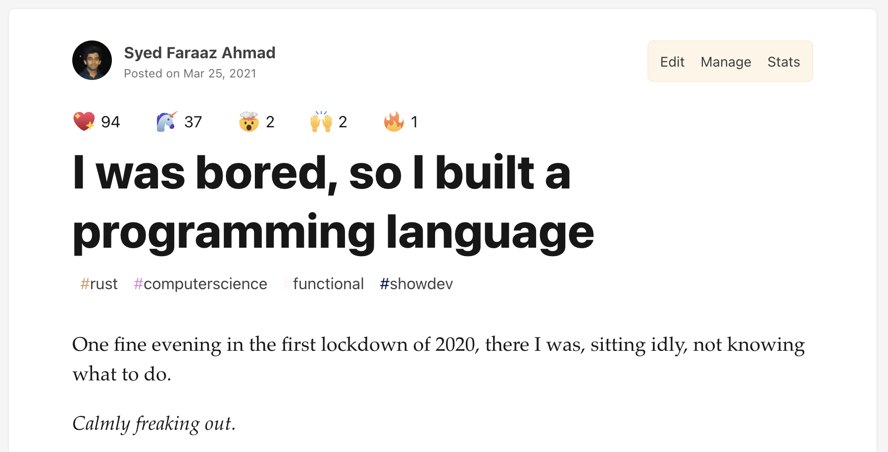
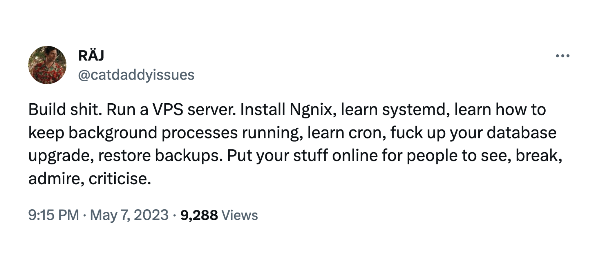

> You can't connect the dots looking forward; you can only connect them looking backwards. So you have to trust that 
>the dots will somehow connect in your future. You have to trust in something - your gut, destiny, life, karma, whatever
>. This approach has never let me down, and it has made all the difference in my life.
>
>-- Steve Jobs

I've been wanting to write this blog post for a few years now, but I've never had the kind of experience to 
convince myself that I'm the right person to do so. 

You see, I've been interested in computers for as long as I can remember.
It started off with playing video games, quickly entering cheat codes in Grand Theft Auto to try and break the engine, 
editing the config files to flip the game mechanics, downloading website templates and messing up the CSS, trying to 
build my own operating system, my own video games, it goes on. So when high school ended, it was pretty clear to me 
that **I wanted to do something with software, I just didn't know what.**

I've heard a lot of other folks have this problem too, especially younger developers. Given the advancement of tech
in the last 10 years, combined with massive proliferation of tech stacks, I believe the opportunity costs are higher than 
ever, which leads to a lot of anxiety and FOMO. I have wrestled with this issue for quite a while, and I don't know if
the FOMO ever goes away, but you can definitely reduce it by trying out the things you are interested in, and trust that
the dots will somehow connect in the future.

So, over the past couple of years that is what I've been trying to do -- explore different areas in software development
that fascinate me. These are most of the things I have tried, and how I went about doing so.

## Game development

Like most people I know in tech, video games are what got me into computers. Somewhere along the way, I believe 
every developer tries their hand at making a game. Maybe you see your favourite game developers as heroes and just want
to be like them, maybe it is nostalgia that makes you want to recreate the video games you grew up with, or maybe you're
so deep into sci-fi that you want to turn your wild imagination into a real tangible video game. For me, it was all of
the above, **I just knew I wanted to build my own game.** (Or atleast learn how to)

I searched for popular game engines, three of them stood out: Unity, Unreal Engine, and Godot. Unity and Unreal are
very widely used professionally and have the most amount of educational content. They also have royalty fees for when your game
starts doing really well financially, but I wasn't going to reach that scale so that wasn't a concern for me.

I really liked Unity given thats its very approachable for beginners, but the editor kept freezing and crashing every now and then. That 
was a huge turnoff for me since I value prototyping speed very highly. I also tried Unreal Engine, it had some really 
good features for building high-quality visuals, and has since made them 10x better ([Nanite](https://dev.epicgames.com/documentation/en-us/unreal-engine/nanite-virtualized-geometry-in-unreal-engine) and [Lumen](https://dev.epicgames.com/documentation/en-us/unreal-engine/lumen-global-illumination-and-reflections-in-unreal-engine)), but it's visual scripting system called Blueprints felt really cumbersome. You _CAN_ use C++ in Unreal Engine 
but it seemed like they were really aggressively pushing Blueprints as a first-class citizen, and as someone who wanted 
to write code to build games this was a huge turnoff.


#### Enter Godot

Godot is a fully open-sourced (MIT licensed) and free game-engine that is lightweight on your machine and easy to use.
Its interface is very similar to that of Unity, and has a scripting language that is basically python, making it very 
easy to get started with. It's completely free forever -- no  strings attached -- but if you find value in it, I 
recommend you to make atleast a small donation as its development is completely open sourced.



Initially while using Unity and even after it, I started off by trying to make a AAA game -- 3D, high graphical detail, 
third person shooter, open world, character interactions, player inventory with animations -- the whole nine yards.

**Rookie mistake.**

While developing a game you need to design characters, write code, write a story, implement animations, interactions,
inventory, music, sound effects, A/B testing with real beta testers, market your game

and it is... everything.

Your first game should probably be tic-tac-toe, or pacman or something similar. It should be extremely simple to
implement, and be a safe space for you to learn your game dev environment.



You only make your life worse by starting out with a game that has a massive scope. There's a reason that even massive
game studios with all the budget and expertise in the world, require their employees to undergo "crunch periods" (Where they work on
the games non-stop, sleep in their offices, and don't see their families for weeks). Most people start
out learning game-dev with these massive ideas they have for games, and they burn out trying to learn and build 
everything.

I did it too, guess what happened next!

Oh well, onto the next thing.

## Web development

Look, I've been fooling around with HTML/CSS since I was 9. 

I was there when the HTML5 and CSS3 launch was the big thing.

I remember vividly that I had once stayed home from school because of a fever. When I felt slightly better, I'd
hopped onto https://w3schools.com to do a JavaScript quiz.


I was obssessed with different website templates, all of their unique designs with CSS and their interactivity using
jQuery. I used to download templates from [HTML5Up](https://html5up.net) and mess around with them all day, 
it was the best thing ever. 

This is probably also why I am usually confused when people say CSS is hard. You can code Djikstra's graph search 
algorithm from scratch but you don't know how Cascading Style Sheets (CSS)... cascade? Please.

**Learn your tools.**

Anyways, at the end of high school, I wanted to take my knowledge further in this area. I already knew a bit of
JavaScript, so I didn't need much convincing to try out Nodejs. It had been out for a while, so there were
more than enough libraries & frameworks like Express, Knowckout.js, AngularJS, Ember, etc. But it didn't matter who 
made the tutorial, all of it came with tons of manual configuration. 

**It was too much configuration, I was repulsed.**

I just wanted to build stuff, I wasn't interested in setting up 10 tools before I can return a Hello World from an API
endpoint. I searched around for something that didn't need so much **configuration**, which is probably what hit the 
right search keywords. I stumbled upon Ruby on Rails, which (surprise, surprise) had the tagline of **"Convention over 
Configuration"**. I knew just then, this is exactly what I need.

The fact that you could just run 

```
rails generate scaffold Post title:string body:text
```

and it generates a fully-functional (albeit basic) blogging app, was pure bliss. Here's 
[DHH](https://twitter.com/DHH) (Creator of Ruby on Rails) building and deploying a blog to production in a couple
minutes.

 

<video width=100% controls>
    <source src="https://d1snj8sshb5u7m.cloudfront.net/Rails7.mp4" type="video/webm">
    Your browser does not support the video tag.  
</video>



Learning Ruby on Rails really did kickstart my career in ways I would not have thought of, and I wouldn't have it any 
other way. 

You should check it for yourself at [their homepage](https://rubyonrails.org).

## Systems development

I built a lot of projects in the realm of web development -- chat apps, todo lists, blogging platforms, code judge 
platforms. But it was a lot of the same, sending requests back and forth to a web server, with only a slightly different 
flavor each time. I wanted to do something dfferent, something a few levels _deeper_.

**Something much closer to the metal.**

Well, what is closer to the metal than an operating system? I don't remember how but I found a tutorial for building
and operating system in Rust. What more could one ask for? So I went over to https://intermezzos.github.io/ and got 
cracking. It involved writing a bootloader in x86 Assembly, booting into "real mode", making the jump to "Long Mode" 
where the real work begins. The intermezzos tutorial seemed incomplete, but thankfully they mention that it's based on 
https://os.phil-opp.com, so I went over there and got into a lot more things:

Managing exceptions, double faults (exceptions while handling exceptions), dealing with hardware interrupts, managing
memory, allocating the heap,.... And it goes on.

It looked something like this:


**But this time it was exciting, not overwhelming.**

It seemed like a signal that I enjoy working on things that are around the same level of hardware abstraction as operating systems.
This was around the time that COVID hit, and yet again I found myself wanting to work on something interesting again.
I don't remember why but I decided to build my own programming language, HOW HARD COULD IT REALLY BE?!



I eventually found out, wrote a 
[blog post about it](https://dev.to/faraazahmad/i-was-bored-so-i-built-my-own-programming-language-30f1), and boy did it
do numbers.

This helped me narrow my interests in systems development, helped me find a job where I don't hate every second of it.
Helped me find like-minded people, people who were interested in the same things I was, people who helped me be a 
better engineer. 

I started speaking at technical conferences, local meetups. Met a lot of amazing people in the industry, and it 
snowballed from there.

## Epilogue

None of this is linear, upwards progress; there will be setbacks. Sometimes more setbacks than progress, but you gotta 
make sure the slope trends upwards, little by little.

You've got to try and do a little bit every day, it doesn't have to be some game-changing, world shattering progress, it
just has to be. People overestimate how much they can do in 6 months, and underestimate how much they can do in 6 years.

Expose yourself to different experiences. Work at a massive organization, join a startup, or start your own. 
Go to tech meetups/conferences, be a speaker, "fail" in front of everyone, what's the worst that could happen? Let it happen. You'll
come out better on the other side.



People with a wide range of experiences are more likely to do well in life, you don't have to specialize too soon. You
see it all and eventually make informed judgements on what you want to focus on. You don't need to be an expert on 
everything you do, but atleast make the effort to learn how deep the rabbit hole goes.


Trust me, you're gonna make it.


