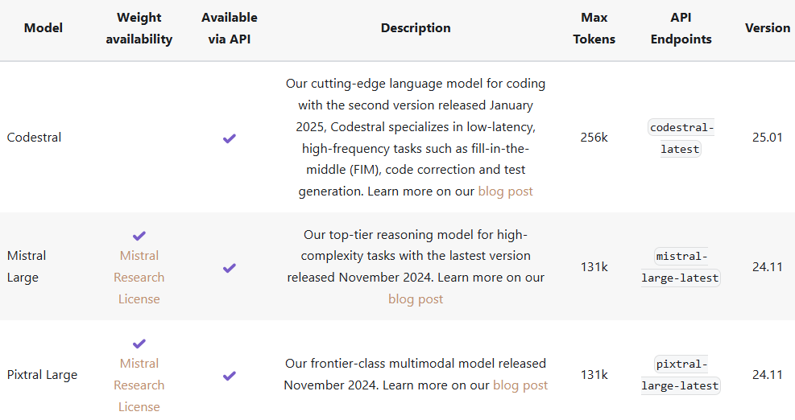

import { LinkPreview } from 'astro-embed';

Have you ever opened a new tab for an article that seemed really interesting but you just don't have the time to read it right now? But then your day ends, and you just don't have it in you to go through a whole article, so you leave it open.

The next day arrives, you find an interesting video to watch on YouTube but again, you dont have the time to watch it right now. So you save it to your __Watch Later__ list, hoping to get back to it after work. 

> Before you know it, a month goes by and you've accumulated 50 such resources that you find interesting. One day you will find the time to get through all of them, just not today.

## Too much of everything

The truth is, there's just too much of everything these days. You wanna learn how to build an LLM yourself and understand everything? Here's 20 research papers, 50 videos and a 100 articles to choose from. Good luck with that.

There's just no way a normal functioning human being can go through them all quickly such that they can retain information and put it to good use. There has to be someone who can guide you through all this mess. You either need a list of essentials from a subject expert, to guide you through the haystack or you're just gonna end up missing out on a lot of knowledge. Your other option is to get a PhD in this domain and possibly dedicate your career to it.

Not everyone can or wants to do this. Sometimes all you need is a quick catch-up on a certain topic, or you just need to go a little deeper in it without having to spend years on it. With so many resources available -- all fighting for your attention -- it can sometimes seem impossible to find the right resource.

Did you know there are articles people write just so they can rank higher in search engine results? These are called SEO articles and their only aim is to hit the right keywords so they can rank higher in Google searches. They often contain a lot of fluff and aren't very informational, and you can't filter them out because they're literally optimizing for your search keywords.

You know what the worst part is about generative AI? People used to take hours to write a couple SEO articles per day, but now? You feed a few keywords to an LLM and it churns out BS articles by the minute.

## There *are* diamonds to be found

Not everything is terrible though, there are some really amazing, well-researched resources on a lot of topics.

> 20 research papers, 50 videos and a 100 articles to choose from.

It's totally possible that all of this is quality content, and you want to go read it all. But alas, the average human only lives for so long. If you spend all your time just gaining knowledge, there wouldn't be much left to take action. It's not the end of the world if you try and get some help to consume all this knowledge. You know what Large Language Models are really good at? Summarizing oceans of text -- structured or otherwise.

## AI for good

What if, instead of using AI to create uncanny art -- based on questionable methods of training, you used it to help you consume more knowledge quicker. This is exactly what I set out to do.

You see, my YouTube _Watch Later_ list has 600+ videos. I can't possibly watch all of them, so I made AI do it. Previously a video would've sat in my list for months, after which I would've either forgetten about it or forced myself to watch it. Either way, it would not be a great experience.


Instead, I get the transcript of the video and send it to an LLM, asking it to provide me a list of 10 most important points and their timestamps in the video. And for good measure, I get the LLM to categorize the video as well, with 3 separate tags, so that it can be grouped later with similar content. Then I can take one glance at the summary and skim through the video in my first watch. If I find it interesting, I would watch it completely, else I discard it from my list.

Game, set, match.

The same goes for academic papers, since they can get very lengthy and information dense. It's better to know as early as possible if I want to spend my time reading a certain paper, rather than spend days on it only to find out it's not something I'm interested in. Like any decent knowledge consumption tool, I've added the ability to create notes for every submission -- just don't expect a full-blown [Zettelkasten](https://zettelkasten.de/introduction/) system.


## Under the hood

There's not a whole lot going on under the hood. The arhitecture for this is fairly simple:


The user only ever interacts with the Rails app, managing submissions and associated notes. When you create a submission in the Rails app, it creates background jobs that communicate with the FastAPI server. The server then downloads and processes your content, sends it to Mistral and gets the most important points from it. This separate server was used because Mistral provided a really convenient Python SDK, you could technically remove the server by directly making API calls to Mistral's REST API but that would require writing a lot of boilerplate, which I don't want.

I specifically chose [Mistral](https://mistral.ai/) because of their recently much improved [Document OCR capabilities](https://mistral.ai/news/mistral-ocr) and the fact that they provide an Experimental tier that you can use for free.

The prompts used with the LLMs are fairly straightforward as well, here's the prompt I used to get the most important points from the video transcript:

```python
messages = [
    {
        "role": "user",
        "content": [
            {
                "type": "text",
                "text": "Give me the 10 most important points from the text. Return the result as an array in a JSON string."
            },
            {
                "type": "text",
                "text": transcript_text
            }
        ]
    }
]
chat_response = client.chat.complete(
    model="mistral-large-latest",
    messages=messages
)
```

Note that I use the `mistral-large` model for tasks that need to understand the text and infer the most important points. This usually gives me satisfactory results thanks to its [123 Billion parameter model](https://mistral.ai/news/mistral-large-2407). Here are some of the models provided by Mistral that you might find useful for daily tasks:



In the spirit of open-source (but mostly because I don't have the bandwidth to [compete with Google](https://notebooklm.google/)), I'm sharing this project under the MIT "Do what you want with it" License.

<LinkPreview id="https://github.com/faraazahmad/kai" />

There are still features to be added and bugs to be fixed. Things like:

* Processing links that are just plain articles i.e. neither videos nor PDFs.
* Handling rate limits from Mistral and scheduling job retries.
* Experimenting with a true RAG pipeline, probably using a vector database or just the pg_vector extension with Postgres.

These are left to the reader as an exercise, i.e. I would really like your help with this on the project. Feel free to create PRs and issues.

## Closing thoughts

AI is here to stay, and as billions are poured into it, it will keep getting better.

It's amazing that a secondary _intelligence_ is just an API call away. An AI might not necessarily take your job, but someone using AI just might. Either you ignore it as some _toy_ or you incorporate it into your workflow -- 10xing your productivity -- as a true bicylcle for the mind.

The choice is yours.
