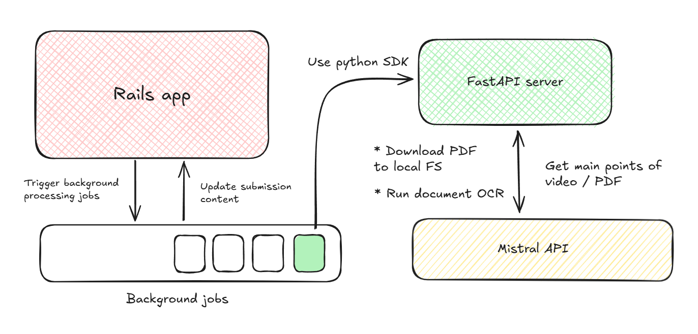

Tell me this, have you ever opened a new tab for an article that seemed really interesting but you just don't have the time to read it right now? But then your day ends, and you just don't have it in you to go through a whole article right now, so you leave it open.

The next day arrives, you find an interesting video on YouTube but alas, you dont have the time to watch it right now. So you save it in your __Watch Later__ list, hoping to get back to it after work. 

> Before you know it, a month goes by and you've accumulated 50 such resources that you find interesting. One day you will find the time to get through all of them, just not today.

## Too much of everything

The truth is, there's just too much of everything these days. You wanna learn how to build an LLM yourself? Oh here's 20 research papers, 50 videos and a 100 articles to choose from. Good luck with that.

There's just no way a normal functioning human being can go through them all such that they can retain information and put it to good use. There has to be someone who can guide you through all this mess. You either need a list of essentials from a subject expert, or you're doomed -- there's no middle ground.

Did you know there are articles people write just so they can rank higher in search engine results? These are called SEO articles and their only aim is to hit the right keywords so they can rank higher in Google searches. They often contain a lot of fluff and aren't very informational, and you can't filter them out in your searches because they're literally optimizing for your search keywords.

You know what the worst part is about generative AI? People used to take hours to write SEO articles, but now? You feed a couple keywords to an LLM and it churns out BS articles by the minute.

## There *are* diamonds to be found

Not everything is terrible though, there are some really amazing, well-researched resources on a lot of topics.

> 20 research papers, 50 videos and a 100 articles to choose from.

It's totally possible that all of this is quality content, and you want to go read it all. But alas, the average human only lives for so long. If you spend all your time just gaining knowledge, there wouldn't be much left to take action. It's not the end of the world if you try and get some help to consume all this knowledge. You know what Large Language Models are really good at? Summarizing oceans of text -- structured or otherwise.

## AI for good

What if, instead of using AI to create uncanny art -- based on questionable methods of training, you used it to help you consume more knowledge quicker. This is exactly what I set out to do.

You see, my YouTube _Watch Later_ list has 600+ videos. I can't possibly watch all of them, so I made AI do it. Previously it would've sat in my list for months, after which I either forget about it or I force myself to watch it. Either way, is not a great experience for me.

Instead, I get the transcript of the video and send it to an LLM, asking it to provide me a list of 10 most important points and their timestamps in the video. And for good measure, I get the LLM to categorize the video as well, with 3 separate tags, so that it can be grouped later with similar content. Then I can take one glance at the summary, skim through the video in my first watch. If I find it interesting, I will watch it completely, else I discard it from my list.

> Game, set, match.

The same goes for academic papers, since they can very lengthy and information dense. It's better to know as early as possible if I want to spend my time reading a certain paper. Ofcourse I can add my own notes to the submission too.

## Under the hood

The arhitecture for this is fairly simple. 

## Closing thoughts
