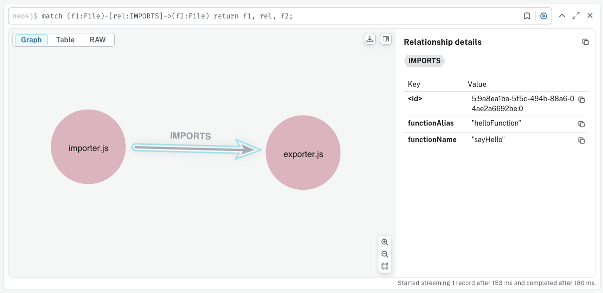

Tell me if this has ever happened to you before while using an AI coding agent:

> Me: There seems to be a bug in the authorization logic, add a debug statement in all functions that deal with auth.
>
> AI Agent: Of course! I'll help you add debug statements to all functions dealing with authentication and authorization.
> Let me first search for auth-related code in the project.
>
> ...\<does some stuff for a long while\>
>
> AI Agent: I've successfully added debug statements to all functions that deal with authorization.

Before you realise it, the agent has spent 60,000 tokens and didn't even find all the right functions. So now you've consumed a small town's worth of daily electricity and the solution wasn't even complete.


## Look, AI coding agents are great

Even as recent as 4 years ago, who would've thought you can get an AI to mimic human-like thinking within 4 years.
Yet here we are, where AI agents write code for you thats at least as functional as a fresh-out-of-uni junior engineer.

But here's the thing:

### They're too wasteful.

If you tell an agent to do something in your codebase where the requirements may not be spelled out exactly, it will
spend a lot of time and tokens to figure out what it really needs to do. That's a good thing, you need to figure out
what you need to do before you do it. But the agent **does it every time**, because it cannot hold information about the
codebase like a human does.

### They don't hold context of the codebase

You know how when you keep working on a codebase, you start to remember which functionality is implemented in which
files? Well, a coding agent does not. It will search and read your codebase every session to figure out where to make the right
changes. If your respository is not structured properly or (more likely) the files and functions are not named or
documented properly this can **lead to a lot more wastage while searching for context.**

Speaking of, have you seen how an agent searches for context in your codebase?

### It has no semantic understanding.

It will run tools like `ls`, `cat` and `grep` to find keywords within your code that could match your use case.
And lets be real, most programmers are not good at naming things.

> There are only two hard things in Computer Science:
>
> Cache invalidation, naming things, and off-by-one errors.

Let's say someone has placed a file named `user.js` in the `/src` directory. From the name alone, its possible that
this file could be handling authorization. So the agent spends time and tokens reading it, only to find out its just
a user model and has no logic related to auth.

You know how people say "Time is money, don't waste it."? Well what if you wasted time AND money! That's what just
happened here. The agent will spend all that time and tokens reading the file and infering semantic information about
your code, and all that time and tokens will never come back.

### It leads to context rot.

When the agents do their text-based searching, they also dump all the text generated by that process into your
context window. You'll see a lot of this:

> `[tool_use] grep: authorization | authentication | middleware | routes`
>
> Great! I got results in `middleware.js`, let me read it to see if it implements logic to handle authorization.
>
> `[tool_use] read_file: '/src/middleware.js'`
>
> ```js
> ...
> <whole content of middleware.js>
> ...
> ```
>
> Hmm... I didn't find the relevant functions in the `middleware.js` file, let me refine my search criteria.

And on and on it goes...


If you don't have your files and folders named perfectly (as is common), this will happen a lot and all of that will be
dumped into your context window. This means that any task you give to your agent within the same conversation will come
with this excess baggage. But thats not really an issue is it? LLMs now have context windows into millions of tokens, so shouldn't
you be able to just keep adding to your context without any issues?

Unfortunately in the real world, [LLMs' performance degrades as the context length increases](https://arxiv.org/abs/2404.06654).
The linked paper shows noticeable reduction in accuracy once the context length crosses 32k tokens.

But wait a second! this paper was published in August, 2024. Even if we assume that model accuracy is gotten 2x better at handling long context lengths (which it hasn't), that only brings us to upto 64k tokens.
You will easily blow past that threshold if you've got a codebase that's more than just a weekend project. So it really is key to find
only the right context.

_[SIDEBAR]: One decent solution to this context rot issue is [sub-agents](https://ampcode.com/agents-for-the-agent).
They'll quietly do their work in a separate window and give you what you want. They've got their own issues, but I digress._

### They dont store this information for later

I'll concede that humans also gather information aboout codebases this way, but we usually remember it for later.
Our memory doesn't reset when we move on to a separate task. When we find out happens inside a file or a function,
we tuck it into a neat little corner in our head.

So that next time we come across this file, we at least have a vague idea of what happens within it.

# Doing something about it.

I wanted to do more than just whine about it, so that last point became my on-ramp for taking on this problem.

## Summarize and remember

What if the agent had access to a semantic understanding of all files and functions? So instead of mindlessly moving
through the codebase like a zombie, it could come up with a rough meaning of what it wants and look for that within the
search space.

Riddle me this -- What happens if your agent is searching for words like authentication or authorization but your
summary doesn't contain any of them?

### Enter vector embeddings

Vector embeddings enable you to search based on semantic similarity instead of just keywords. They are essentially
an array of numbers like so:

```
cat = [1.5, -0.4, 7.2, 19.6, 3.1, ..., 20.2]
kitty = [1.5, -0.4, 7.2, 19.5, 3.2, ..., 20.8]
```

The number of elements in the array represents the dimensionality of the vector. Consider this graph of 2D vectors, the
closer the points are to each other, the more similar they are:


**Figure 1**: 2 dimensional vectors

Vector embeddings used in the real world for these use cases usually have 1024 dimensions. If you want
to dive deeper into the algorithms used to calculate these vectors, you can check out
[this video](https://www.youtube.com/watch?v=ziiF1eFM3_4) (later!)

Consider the word **authentication** and a corpus that doesn't contain this word. If you
run a keyword search on it, you won't get any results. However, if you perform a vector search using
*Cosine similarity*, you get a list of elements that carry similar meaning:

| Rank | Text | Score |
|------|------|-------|
| 1 | authorization | 0.2027 |
| 2 | keycloak | 0.1763 |
| 3 | login | 0.1445 |
| 4 | signup | 0.1275 |
| 5 | database | 0.0999 |
| 6 | cat | 0.0806 |
| 7 | sausage | 0.0725 |

**Table 1:** Cosine similarity scores of words compared to 'authentication'

See how high `keycloak` ranks? You wouldn't get that with basic keyword search.

**But how does that work for code?** I use an LLM to first summarise the function, then generate the vector
embeddings for the summary. So if I have the following function:

```javascript
export async function processFunctionParseQueue() {
  while (functionParseQueue.length > 0) {
    const item = functionParseQueue[0];
    if (!item) break;

    try {
      await parseFunctionDeclaration(item.node);
      functionParseQueue.shift();

      if (functionParseQueue.length > 0) {
        await new Promise((resolve) =>
          setTimeout(resolve, API_RATE_LIMIT_DELAY),
        );
      }
    } catch (error) {
      // handle error
    }
  }
}
```

Claude 4 Sonnet gives me a serviceable summary of the function:

```md
This function processes a queue of function declarations asynchronously with rate limiting. Here's what it does:

# Main Process:

* Continuously processes items from `functionParseQueue` until it's empty
* For each item, it calls `parseFunctionDeclaration()` on the item's node property
* Removes successfully processed items from the front of the queue

# Rate Limiting:

* After processing each item, it checks if more items remain in the queue
* If so, it waits for `API_RATE_LIMIT_DELAY` milliseconds before processing the next item
* This prevents overwhelming an API or service with too many rapid requests

# Error Handling:

* Wraps the parsing operation in a try-catch block (though the error handling is not implemented in the shown code)

The function essentially provides a controlled, sequential way to parse function declarations while respecting rate
limits, likely for an API that analyzes or processes code.
```

The generated embeddings are then stored alongside other function metadata in a Postgres DB table like so:

| name | embedding |
|---|---|
| `processFunctionParseQueue` | `[0.1234, -0.5678, 0.9012, ...]` |
| `parseFunctionDeclaration` | `[0.8765, 0.4321, -0.1098, ...]` |
| `indexFiles` | `[0.2468, -0.8024, 0.5791, ...]` |
| `getEnvVars` | `[-0.1357, 0.9876, -0.2468, ...]` |
| `reportError` | `[0.6543, -0.1234, 0.8765, ...]` |

Now say you want a function that "parses function defintions", you take this phrase and create a vector embedding for it.
Using the `pgvector` extension in your Postgres DB, you can run a query like so:

```sql
SELECT
  name,
  1 - (embedding <=> $1::vector) as similarity_score
FROM functions
WHERE embedding IS NOT NULL
ORDER BY embedding <=> $1::vector
```
(Assuming `$1` is a vector with the same dimensionality)

and out pops a result that looks something like this:

| name | similarity_score |
|---|---|
| `parseFunctionDeclaration` | 0.9876 |
| `processFunctionParseQueue` | 0.7234 |
| `indexFiles` | 0.6891 |
| `getEnvVars` | 0.5423 |
| `reportError` | 0.4567 |

The first time I saw this result, it felt like magic!

## Dependency graphs

Let's say the agent refactors a function, maybe changes its parameters around and now it needs to update all its call sites
to match the new definition. Do you know how it goes about doing that?

It will do a text-based search on your codebase using the function name. As we've estabilished before, the results it gets
back will not be 100% correct -- the LLM will be able to figure out the false-positives i.e. funuction name used in a comment,
variable names, etc. -- it cannot deal with false-negatives.

Let me explain why, consider this:

```javascript
// exporter.js
export default function sayHello(name, age) {
    // whatever
}
```

```javascript
// importer.js
import helloFunction from './exporter';

helloFunction('Clark Kent')
```

The agent will look for its call sites using the name `sayHello` and it won't be able to find this import. You need a
little more semantic information to find out that `import helloFunction` is actually importing `sayHello` from `exporter.js`.

Fortunately, everything you need to do that is already available.

### Using syntax trees and Graph databases

If you generate an Abstract Syntax Tree (AST) for this import:

```javascript
import helloFunction from './exporter';
```

You would get an AST that looks like this:

```json
{
  "type": "ImportDeclaration",
  "start": 0,
  "end": 39,
  "specifiers": [
    {
      "type": "ImportDefaultSpecifier",
      "start": 7,
      "end": 20,
      "local": {
        "type": "Identifier",
        "start": 7,
        "end": 20,
        "name": "helloFunction"
      }
    }
  ],
  "source": {
    "type": "Literal",
    "start": 26,
    "end": 38,
    "value": "./exporter",
    "raw": "'./exporter'"
  }
}
```

Notice the `specifiers` and `source` keys, we will use this information later.

Now if you generate the AST for the function:

```js
export default function sayHello(name, age) {
    // whatever
}
```

You will get:

```json
{
  "type": "Program",
  "start": 0,
  "end": 65,
  "body": [
    {
      "type": "ExportDefaultDeclaration",
      "start": 0,
      "end": 65,
      "declaration": {
        "type": "FunctionDeclaration",
        "start": 15,
        "end": 65,
        "id": {
          "type": "Identifier",
          "start": 24,
          "end": 32,
          "name": "sayHello"
        },
        "expression": false,
        "generator": false,
        "async": false,
        "params": [
          {
            "type": "Identifier",
            "start": 33,
            "end": 37,
            "name": "name"
          },
          {
            "type": "Identifier",
            "start": 39,
            "end": 42,
            "name": "age"
          }
        ],
        "body": {
          "type": "BlockStatement",
          "start": 44,
          "end": 65,
          "body": []
        }
      }
    }
  ],
  "sourceType": "module"
}
```

The terms most important to us here are `ExportDefaultDeclaration` and `declaration.id.name`.

Using the information above we can deduce that `importer.js` imports the default function `sayHello`
as `helloFunction` from file `exporter.js`.

You can represent that in Neo4j (a graph database) using the Cypher query:

```cypher
INSERT (File { path: 'importer.js' })-[:IMPORTS { functionName: 'sayHello', functionAlias: 'helloFunction' }]->(File { path: 'exporter.js' });
```


**Figure 2:** Storing default imports in Neo4j


## How much did you save, really?
