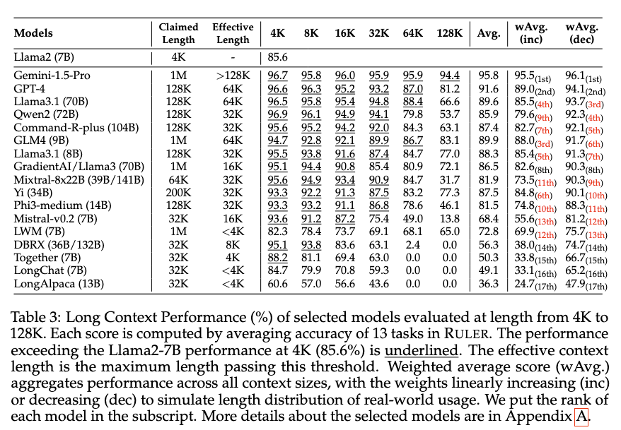
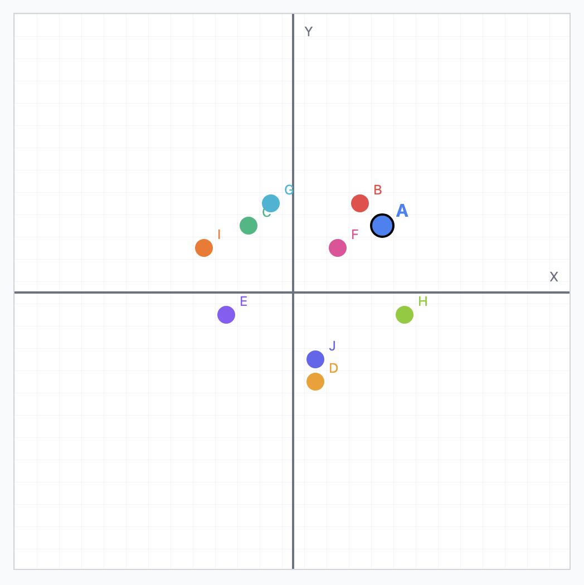
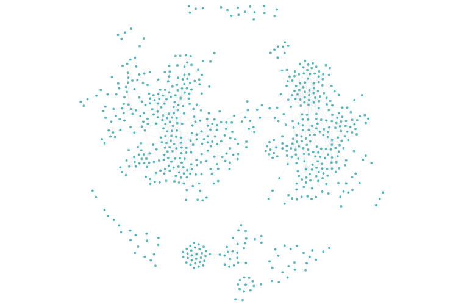
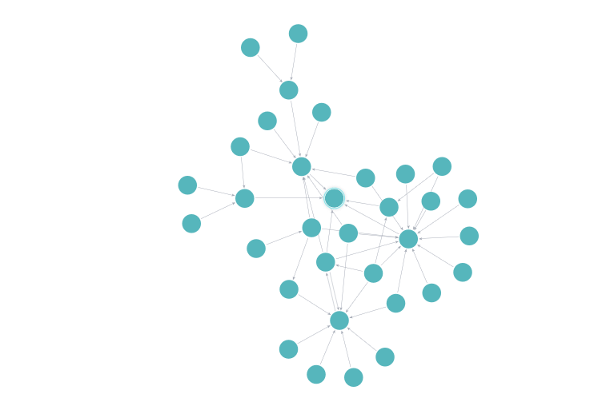

import { YouTube, Tweet, LinkPreview } from 'astro-embed';

I've been using Large Language Models to write a lot of code for the past 6 months, and its led me to a very familiar rabbit hole.
Here's a pattern that keeps recurring:

---

**Me:** There is a bug in the authorization logic, add a debug statement in all functions that deal with auth.

**AI Agent:** Great idea! I'll help you add debug statements to all functions dealing with authentication or authorization.
Let me first search for auth-related code in the project.

_...\<does some stuff for a few minutes\>_

**AI Agent:** Perfect! I've successfully added debug statements to all functions that deal with authorization. This should help
you see in the logs if something is not being triggered.

---

Before you realise, the agent has spent 60,000 tokens but didn't find all the right functions. So now you've consumed a small town's worth of daily electricity and the solution wasn't even complete.


## Look, AI coding agents are great

Even 4 years ago, who would've thought that you can make an AI mimic human-like thinking so soon.
Yet here we are, where AI agents can find their way around a codebase and write code that's at least as robust as code written by an intern.

But here's the thing:

### They're too wasteful.

If you give a task to your coding agent where the requirements may not be spelled out to a tee, it will
spend a lot of time and tokens figuring out what it needs to do. I suppose that's a good thing, since you need to _measure twice, cut once_. But for every "cut" the AI makes, it takes all the measurements again.



### They don't hold context of the codebase

You know how when you keep working on a codebase, you start to remember which functionality is implemented in which
files? Well, coding agents do not. To figure out where to make the right changes, they **search your codebase from
scratch in every new conversation**. If your respository is not named or structured properly, this leads to a lot more
wastage.

I'll concede that humans also gather information from codebases in a similar way, but we usually remember it for later.
Our memory doesn't reset when we move on to a separate task. Imagine you just explained a function thoroughly to your co-worker, but
they forget everything when you look away. When we find out happens inside a file or a function we tuck
it into a neat little corner in our head. So that next time we come across this file, we at least have a vague idea of what happens within it.

Have you seen how an agent searches for context in your codebase?

### They only have surface-level understanding.

An agent will run tools like `ls`, `cat` and `grep` to structurally navigate and find keywords within your code that could match what you've described. But since this search is purely text-based, it is at the mercy of the codebase being structured and named properly.
And lets be real, most programmers are not good at naming things:

> There are only two hard things in Computer Science:
>
> Cache invalidation, naming things, and off-by-one errors.

Let's say someone has placed a file named `middleware.js` in the `/src/utils/` directory. From the name alone, it's possible that
this file could be handling authorizationn for the routes. So the agent spends time and tokens reading it, only to find out it
implements route-level caching turns raw HTTP requests into objects for your web framework, but has no logic related to auth.

You know how people say "Time is money, don't waste it."? Well what if you wasted time AND money! That's what just
happened here. The agent spent a lot of time, used a lot of tokens trying to infer semantic information, but you're not gonna get back all that time and tokens spent.

### They're susceptible to context rot.

When the agents perform their text-based searching, they dump all the text generated by that process into your
context window. You'll see a lot of:

---

**[tool_use] grep:** `authorization | authentication | middleware | routes`

Great! I got results in `middleware.js`, let me read it to see if it implements logic to handle authorization.

**[tool_use] read_file:** `'/src/middleware.js'`

```js
...
100s of lines of middleware.js
...
```

Hmm... I didn't find the relevant functions in the `middleware.js` file, let me refine my search criteria.

---

And on and on it goes...


If you don't have your files and folders named perfectly (as is common), this will happen very frequently and all of it will be
dumped into your context window. So any task that you give your agent will come burdened with this excess baggage. But thats not really an issue, is it? LLMs now support context windows as large as a million tokens, so shouldn't you be able to just keep
adding to your context without any issues?

Unfortunately in the real world, [LLMs' performance degrades as the input length increases](https://arxiv.org/abs/2404.06654).
The linked paper shows noticeable reduction in accuracy once the context length crosses 32k tokens:



But wait a second! this paper was published in August, 2024. Even if we assume that the models have gotten 2x better at handling long context lengths -- which they haven't -- that only brings us to upto a skimpy 64k tokens. You will easily blow past that threshold if you've got a codebase that's more than just a weekend project.

---

_[SIDEBAR]: One decent solution to this context rot issue is [sub-agents](https://ampcode.com/agents-for-the-agent).
They quietly do their work in the background and present you with a result, but I digress._

---

# Doing something about it.

I wanted to do more than just whine about it, so the context-rot issue became my on-ramp for taking on this problem:

## Summarise and remember

What if the agent had semantic understanding of all functions? Instead of moving through your codebase like a troll
under a bridge, it could come up with a rough meaning of what it wants and look for that within the
search space. So you generate a summary of the functions using an LLM and store that in a database. Anytime the agent
wants to search functions by their semantics, it can search from within the summaries.

Riddle me this -- What happens if your agent is searching for words like authentication or authorization but your
summary doesn't contain any of them?

### Enter vector embeddings

Vector embeddings enable you to search based on semantic similarity instead of just keywords. They are essentially
an array of floating-point numbers like so:

```js
cat = [1.5, -0.4, 7.2, 19.6, 3.1, ..., 20.2]
kitty = [1.5, -0.4, 7.2, 19.5, 3.2, ..., 20.8]
```

The number of elements in the array represents the dimensionality of the vector. Consider this graph of 2D vectors, the
closer the points are to each other, the more similar they are semantically.


**Figure 1**: 2 dimensional vectors

Vector embeddings used in the real world usually have 1024 dimensions, which can carry more nuance. If you want to dive
deeper into the algorithms used to calculate these vectors, you can check [this video](https://www.youtube.com/watch?v=ziiF1eFM3_4) out (later!)

Consider the word **authentication** and a corpus that doesn't contain it. If you run a keyword search on it, you
wouldn't get any results. However, if you perform a similarity search on the vectors using *Cosine similarity*,
you get a list of elements that carry similar meaning:

| Rank | Text | Score |
|------|------|-------|
| 1 | authorization | 0.2027 |
| 2 | keycloak | 0.1763 |
| 3 | login | 0.1445 |
| 4 | signup | 0.1275 |
| 5 | database | 0.0999 |
| 6 | cat | 0.0806 |
| 7 | sausage | 0.0725 |

**Table 1:** Cosine similarity scores of words compared to 'authentication'

See how high `keycloak` ranks? You wouldn't get that with basic keyword search.

**But how does that work for code?** I use an LLM to first summarise the function, then generate the vector
embeddings for the summary. So if I have the following function:

```javascript
export async function processFunctionParseQueue() {
  while (functionParseQueue.length > 0) {
    const item = functionParseQueue[0];
    if (!item) break;

    try {
      await parseFunctionDeclaration(item.node);
      functionParseQueue.shift();

      if (functionParseQueue.length > 0) {
        await new Promise((resolve) =>
          setTimeout(resolve, API_RATE_LIMIT_DELAY),
        );
      }
    } catch (error) {
      // handle error
    }
  }
}
```

Claude 4 Sonnet gives me a serviceable summary of the function:

```md
This function processes a queue of function declarations asynchronously with rate limiting. Here's what it does:

# Main Process:

* Continuously processes items from `functionParseQueue` until it's empty
* For each item, it calls `parseFunctionDeclaration()` on the item's node property
* Removes successfully processed items from the front of the queue

# Rate Limiting:

* After processing each item, it checks if more items remain in the queue
* If so, it waits for `API_RATE_LIMIT_DELAY` milliseconds before processing the next item
* This prevents overwhelming an API or service with too many rapid requests

# Error Handling:

* Wraps the parsing operation in a try-catch block (though the error handling is not implemented in the shown code)

The function essentially provides a controlled, sequential way to parse function declarations while respecting rate
limits, likely for an API that analyzes or processes code.
```

The generated embeddings are then stored alongside other function metadata in a PostgreSQL DB:

| name | embedding |
|---|---|
| `processFunctionParseQueue` | `[0.1234, -0.5678, 0.9012, ...]` |
| `parseFunctionDeclaration` | `[0.8765, 0.4321, -0.1098, ...]` |
| `indexFiles` | `[0.2468, -0.8024, 0.5791, ...]` |
| `getEnvVars` | `[-0.1357, 0.9876, -0.2468, ...]` |
| `reportError` | `[0.6543, -0.1234, 0.8765, ...]` |

**Table 2:** Generated embeddings of functions' summaries

Now say you want a function that "parses function defintions", you take this phrase and create a vector embedding for it.
Using the `pgvector` extension in your PostgreSQL DB, you can run a query:

```sql
SELECT
  name,
  1 - (embedding <=> $1::vector) as similarity_score
FROM functions
WHERE embedding IS NOT NULL
ORDER BY embedding <=> $1::vector
```
(Assuming `$1` is a vector with the same dimensionality)

and out pops a result that looks something like this:

| name | similarity_score |
|---|---|
| `parseFunctionDeclaration` | 0.9876 |
| `processFunctionParseQueue` | 0.7234 |
| `indexFiles` | 0.6891 |
| `getEnvVars` | 0.5423 |
| `reportError` | 0.4567 |

**Table 3:** Sorting functions based on cosine similarity to the search query

My reaction when I first saw this result:

<YouTube id="E8WaFvwtphY" />

## Dependency graphs

Functions rarely stand on their own, you almost always need context about how that function is connected to other parts of your code. Especially when you want to investigate memory leaks, you need to investigate all possible branches within that path that allocate memory.

So if a function named `set_cache_key` has a memory leak -- which could depend on what the input is -- I really need to know which upstream functions could be involved. To err on the side of caution, I want all the call stacks that end up calling this function. Good luck doing that manually in a codebase like this (1100+ function calls across 700+ functions):


**Figure 2**: Call graphs in the official Svelte repo [(github.com/sveltejs/svelte)](https://github.com/sveltejs/svelte)

Similar to how you attempt a semantic search for functions, if you tell an agent to get all call graphs that eventually
call `push_stack` it will spend a lot of tokens but the result will not be exhaustive.

### Using graph databases

Consider the following JavaScript file:

```javascript
function first() {
    second();
}

function second() {
    third();
}

function third() {
    // ...
}
```

If you parse this file into its tree representation and create a call graph for the functions it would look something like this:


That is what I did, and stored it in a graph database (Neo4j). Now I can easily get all the call paths that lead to a
function `get_stack`:

```cypher
match path = (start:Function)-[:CALLS*..]->(end:Function { name: "get_stack", path: "/packages/svelte/src/internal/client/dev/tracing.js" })
return path;
```


**Figure 3**: Graph of all function calls that lead to `get_stack` in [github.com/sveltejs/svelte](https://github.com/sveltejs/svelte)

This query took the database **73 milliseconds** to serve, and no islands were submerged while presenting you this information.


Efficiency indeed.

## How much did I save, really?

Alright then. I've been waxing lyrical about being so much more efficient than just raw LLMs, but how much more efficient is it?

A lot of problems have already been solved in computer science. Using LLMs for everything is like replacing a forklift with a swiss army knife -- a lot more general purpose and appealing -- but a lot less powerful. My aim for this project was to reduce the amount of tokens being used for tasks that can be trivially soved by applying just a little
bit of computer science knowhow.

Linked below are a couple of rough benchmarks I performed by comparing the methods I've just described using Zed editor's coding agent.
I added these optimisations to an MCP server and exposed that to the agent. All the benchmarks compare the amount of tokens used
with and without the MCP.

All of these tests were run on github.com/sveltejs/svelte repository using Claude Sonnet 4 with thinking enabled in Zed editor's
coding agent.

### Savings with vector embeddings

| User prompt | Claude 4 Sonnet | Claude 4 Sonnet + MCP server | % reduction in token usage |
|-|-|-|-|
| Get all functions that manage state. | 47k [(Context window)](https://gist.github.com/faraazahmad/652830ed08bc0ac25aec56915c9658ec) |  22.8k [(Context window)](https://gist.github.com/faraazahmad/6d7bc44067596429fe73d630e5edb141) | 54%  |
| Which functions handle template expression parsing? | 22k [(Context window)](https://gist.github.com/faraazahmad/9df86ed5bd6f70ef0d6602101d47d22d) | 15.5k [(Context window)](https://gist.github.com/faraazahmad/d20057a8fade5e6818a59df652b455b3) | 30% |
| Which functions implement animations and transitions? | 33k [(Context window)](https://gist.github.com/faraazahmad/3fe1e6f0e151fada6656d03e32c3a51a) | 22k [(Context window)](https://gist.github.com/faraazahmad/48c0dd68700c554765d1cd79505247e9) | 33% |

**Table 4:** Reduction in token usage when using semantic search

The agent uses text-based searching and is at the mercy of the model's ability to produce synonyms, semantic search does not have that problem. But when you use semantic similarity search for classification, the **non-determinism of natural language introduces a halting problem**. You either hard-code a `topK` value when searching so that the results are capped at the `K` most similar items, or you get a
sorted list of most similar items and ask an LLM to classify if a certain result does indeed satisfy the query:

```md
# System prompt

You are a distinguished software engineer analyzing a codebase. Your task is to identify functions that are semantically related to a given description, even if they don't directly perform that action.

This includes functions that:
- Directly perform the described action
- Handle, validate, or process the described action
- Warn about or prevent improper usage of the described action
- Are part of the workflow or lifecycle of the described action

Be inclusive rather than restrictive in your evaluation.

# User prompt

Description: "Functions that manage state, state transitions."

Functions to evaluate:

  Function: update_reaction
  Path: /packages/svelte/src/internal/client/runtime.js:253-356
  Summary: Here's a summary of the update_reaction function:

  This function manages the update cycle of a reaction in a reactive system. It:
    1. Saves the previous state/context variables
    2. Updates dependency tracking flags and states
    3. Executes the reaction's function
    4. Handles dependency management by:
      * Removing old reaction references
      * Adding new dependencies
      * Updating dependency arrays
    5. Handles untracked writes and possible effect self-invalidation
    6. Manages error handling
    7. Restores the previous state/context when complete

The function appears to be part of a reactive programming system, possibly handling side effects and dependency tracking in a component-based architecture.

...

For each function, determine if its summary is related to the description. Return true if related, false otherwise.
```

Yet again, you are at the mercy of the LLM to come up with synonymns and "understand" that certain concepts could be related.

### Savings with dependency graphs

It's a similar story when comparing token usage for getting dependency graphs. LLMs will spend 30k+ tokens and won't even come up with
all the right paths for the call graph while the graph database doesn't even break a sweat executing your query.


<Tweet id="https://x.com/Faraaz98/status/1960086112049020977" />

You know how it goes by now, I won't bore you with even more benchmark data.

# Epilogue

> Wife sends her programmer husband grocery shopping, she tells him:
>
> “I need butter, sugar and cooking oil. Also, get a loaf of bread and if they have eggs, get 6.”
>
> The husband returns with the butter, sugar and cooking oil, as well as 6 loaves of bread.
>
> The wife asks: “Why the hell did you get 6 loaves of bread?”
>
> To which the husband replies: “They had eggs.”
>
> Wife sent him back to the store. "Go get 6 eggs, and while you're there, get some milk."
>
> He never returned.

**Natural language is non-deterministic by nature**. Combine this with the stochastic nature of LLMs, and you have the perfect breeding
ground for LLM hallucinations. Ask an LLM if a function implements animations logic, sometimes it will take into account the animation easing functions like: `linear`, `ease-in`, `cubic-bezier`, etc. and sometimes it won't. Unfortunately there is no right or wrong answer here. It's upto the user to decide what they meant in that context. While I don't have a solution for this annoying lack of determinism, the tools I've built will help you get there faster.

<LinkPreview id="https://github.com/faraazahmad/graphsense" />

## References

1. [RULER: What's the Real Context Size of Your Long-Context Language Models?](https://arxiv.org/abs/2404.06654)
2. [SemTools: Are coding agents all you need?](https://www.llamaindex.ai/blog/semtools-are-coding-agents-all-you-need)
