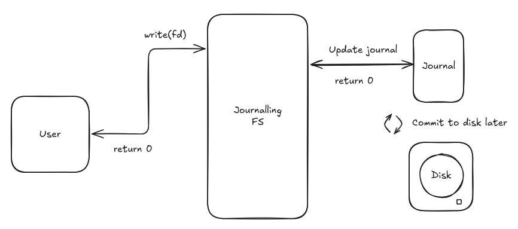

import FsyncgateCollage from '@/components/FsyncgateCollage.astro'
import MarginNote from '@/components/MarginNote.astro'
import FsAnim from './filesystem-is-lying-to-you/FsAnim.astro'

<p class="lede">I want to tell you about the day a program I wrote did everything right.</p>

It checked every error code.

It wrote the transaction to a WAL.

It called `fsync()` before doing the important thing.

It aborted when `fsync()` returned an error.

**Then it lost $200,000 of pretend money**.

The money was fake, but the bug certainly wasn't. And the really annoying part was that I wasn't doing anything obviously stupid. I wasn't forgetting to call `fsync()`. 
I wasn't ignoring an `EIO` error. I wasn't deleting the WAL halfway through for shits and giggles. 
I was doing what the textbook says, the problem was my mental model of what `fsync()` meant.

That's what sent me down this rabbit hole.

---

## What does `fsync()` actually do?

Let's start with the mental model I had before this experiment:

```text
write()
   │
   ▼
fsync()
   │
   ▼
"cool, it's on disk"
```

Seems reasonable ¯\\\_(ツ)\_/¯ 

If I'm building a little payment system, I could do:

```text
write transaction to WAL
        ↓
      fsync()
        ↓
   send the money
```

The WAL is durable before I send the money, **what could possibly go wrong?** Famous last words.

Apparently quite a lot can. Because the actual path looks more like this:

<section style="text-align: center">
```text
MY PROGRAM
│
write()
│
▼
PAGE CACHE
│
writeback
│
▼
FILESYSTEM
│
▼
BLOCK LAYER
│
▼
STORAGE CONTROLLER
│
▼
SSD / DISK
```
</section>

There are a bunch of layers between "my program wrote 64 bytes" and "those 64 bytes are now sitting 
safely somewhere that survives a power cut". And all of those layers have slightly different ideas 
about what **done** means.

That word is doing a *lot* of work here.

---

## `write()` doesn't actually put your bytes on disk

Sorry to burst your bubble, but the `write()` function doesn't commit your bytes to disk. Let me show you.
Consider this extremely sophisticated database:

```python
with open("todos.txt", "w") as f:
    f.write("buy milk")
```

Now imagine the laptop immediately loses power after `write()` returns. What is in `todos.txt` when it comes back on?
You might expect either the old file or the new one containing "but milk". After all, the write succeeded.

Right? Welllll...

Unfortunately, **the filesystem never signed that contract with you**. Depending on what had already reached 
stable storage, you could potentially see anything from the below:

* the old contents
* the new contents: buy milk
* partially updated contents or other filesystem-dependent results in some failure scenarios
* an empty or missing file, depending on what happened before the crash and the filesystem/storage behavior

A successful `write()` basically means 
the kernel accepted the bytes for writing. The dirty data can sit in memory and be written back later.  **It's just 
one of the sad consequences of having to make computers really fast.** If every tiny write had to _synchronously_ wait for storage, we'd spend a remarkable amount of time in our lives staring 
at spinning beach balls while a computer performs the ancient ritual of moving bytes from one place to another.

So we get this:

```text
write() returned
      ↓
"the kernel accepted my bytes"
```

not:

```text
write() returned
      ↓
"these bytes will survive a power cut"
```

You might say, "Well that's inconvenient, but I'll just use `fsync` to commit the changes to disk". 

That'll do the trick right?

Right??


---

## Journaling filesystems are not a magic durability spell

Before we get to `fsync()`, there’s one more piece of the puzzle: **journaling**.

<section class="font-serif italic">
The idea is wonderfully boring.
</section>

Imagine an accountant updating a giant ledger. They wouldn’t just start changing the account balances and hope 
nobody knocks over the desk halfway through. Instead, they will first write down the transactions separately and 
then apply those changes to the account balances. If they’re interrupted halfway through, they can use the 
transaction record to finish the update and restore the ledger to a coherent state.



A journaling filesystem does roughly the same thing for its **own bookkeeping**. Before making certain 
changes, it records them in a journal. If the machine crashes halfway through, the filesystem can 
replay that journal and reconstruct its internal structures into a consistent state.

But there’s an important distinction here:

> **A filesystem can be perfectly consistent while your application data is still wrong.**

Suppose the filesystem was halfway through creating a directory entry and updating an `inode` when the 
machine lost power. The journal can help the filesystem finish or roll back those metadata changes, 
leaving the filesystem in a valid state. But that doesn’t necessarily mean your application’s write made it to disk.

**Journaling protects the filesystem’s consistency**. It does not, by itself, guarantee the durability of your 
data. But the filesystem being able to say: _"My metadata is internally consistent."_ is not the same thing as your 
database saying: _"Transaction 101 definitely made it to persistent storage."_. Those are two completely 
different promises.

On `ext4` filesystem, for example, you can choose different data modes. 

* `data=journal` is the strongest data-journaling mode. 
* `data=ordered`, the default, orders file data before committing the corresponding metadata transaction. 
* `data=writeback` gives weaker ordering between data and metadata.

The exact implementation details differ across filesystems, but the key idea is simple:

```text
filesystem recovery
        ≠
transaction is durably stored
```

A journal is primarily there to help the filesystem recover **itself**. It does not know that your 64-byte record means:

```text
"Faraaz is about to send someone fifty thousand dollars."
```

Want to ensure your data flow is coherent? The filesystem refuses that responsibility:


---

# So what does fsync() really buy me?

The useful mental model is:

```text
write()
   │
   ▼
dirty data
   │
 fsync()
   │
   ▼
safely committed to disk
```

A successful `fsync(fd)` call asks the kernel to synchronize the state associated with that 
file and wait for the synchronization to complete according to the filesystem/storage contract. 
This is a very useful guarantee. It is also apparently not useful enough for me to keep 
my fictional `$200,000`. Because there's a subtle detail hiding underneath all this:
**storage failures do not always get reported at the operation that caused them.** And Linux deliberately keeps track of some writeback errors so that they are not silently lost. The Linux `fsync(2)` documentation even warns that an `EIO` can relate to data written through another file descriptor referring to the same file.

So our nice little model:

```text
transaction A
     │
     └── fsync() → error for A
```

can look more like:

```text
transaction A
     │
     └── writeback ────────┐
                           │
                           └── EIO
                                │
                                ▼
                         observed later
                         by another I/O
```

That is the part I wanted to see for myself. So I built an experiment:


---

<MarginNote
  title=""
>
  CuttleFS runs in userspace via FUSE, so it can only mock fsync() reporting success or failure, not actually cause it to do so. The experiments are therefore not a literal ext4 reproduction, but the logic does hold across real filesystems as the PostgreSQL fsyncgate saga demonstrated.
</MarginNote>

# Let's break the disk on purpose

I used **CuttleFS**, an educational userspace filesystem developed at University of Wisconsin - Madison for their own research, that lets me inject deterministic storage failures.

The application is a tiny mock payment gateway. The code is intentionally simple:

1. Append a 64-byte transaction record to a WAL.
2. Call `fsync()`.
3. If it succeeds, send the money.
4. If it fails, abort the transaction.

That's it. None of that race-condition gymnastics or any other cleverness.

Then I made the **very first WAL write fail** at the storage layer. And things got weird very quickly.


---

## Scenario 1: fsync() blames the wrong transaction

Let's send two transactions:

```text
tx 101 → $50,000
tx 102 → $30,000
```

The program logs this:

```text
[commit] tx=101 amt=50000: wrote 64 bytes at offset 0
[fsync] tx=101: returned 0 -- wiring the money
[bank] >>> MOCK: releasing wire transfer tx=101 for $50000 <<<

[commit] tx=102 amt=30000: wrote 64 bytes at offset 64
[fsync] tx=102: returned error.InputOutput -- ABORTING tx (no wire sent)
```

Looks completely sensible.

1. Transaction 101 committed.
2. Transaction 102 blew up.

So the application sends the first `$50,000` and does not send the second `$30,000`.

Then I crash the machine and recover the WAL.

```text
[recover] slot 0: BAD MAGIC (0x0) -- skipping (lost write?)
[recover] valid records on disk: 0
[recover] RECOVERED BALANCE = 100000
```

**Zero records???**


Yep. Both transactions are gone. But the first `$50,000` was already sent, so now we have:

```text
REAL WORLD
───────────
$50,000 was sent

MY WAL
──────
No such transaction ever happened
```

<FsAnim scenario={1} />

This is much worse than "a write got lost". My application has performed an external 
side effect without any durable evidence that it did so.

If the customer asks us what happened to the `$50,000?`, our database says:

> "What `$50,000`?"

The bank says:

> "The `$50,000` we already sent? That `$50,000`?!"

Excellent. This is the kind of bug that makes reconciliation someone's full-time job.

**So what actually happened?**

The injected failure was associated with the first WAL write. But `fsync()` for transaction
101 returned **0**. The application trusted that result and sent the money. **The failure 
surfaced later on transaction 102's `fsync()`**.

So this:

```text
fsync(tx 102) → EIO
```

was not a clean little statement saying: _"Transaction 102 is bad."_.  It was closer to: 
_"There is a writeback problem in this file, and congratulations, you are the person 
finding out about it."_ That's a much nastier programming model. And it gives us our first useful rule:

> **Don't assume an `EIO` reported by operation N means operation N is the thing that failed.**

For this experiment, once a deferred writeback error appears, writes since the last known-good synchronization point become suspect.

That's not nearly as convenient as `if (fsync() != 0) rollback();`.

---

## Scenario 2: The error arrives after everyone has gone home

Okay, maybe the first example is just weird because there was another transaction around to observe the error. Let's remove that. 

**One transaction. One `fsync()`. No crash.**

```text
[commit] tx=201 amt=70000: wrote 64 bytes at offset 0
[fsync] tx=201: returned 0 -- wiring the money
[bank] >>> MOCK: releasing wire transfer tx=201 for $70000 <<<
```

The application exits normally. Later, during filesystem shutdown/checkpoint, the 
deferred writeback failure gets detected. But the application is gone. There is 
nobody left to receive the error.

After remount:

```text
[recover] slot 0: BAD MAGIC (0x0) -- skipping (lost write?)
[recover] valid records on disk: 0
[recover] RECOVERED BALANCE = 100000
```

WAT.

We sent `$70,000`. The WAL says we never did. And the program exited with a completely 
clean shutdown. This one bothered me more than Scenario 1. Because now we don't even
have the comfort of saying: _"Well, at least the application got an error."_ **The 
filesystem knew. The application didn't.** 

<FsAnim scenario={2} />

Once the process is gone, an error-handling branch in your code isn't exactly going 
to manifest through sheer vibes.

---

## Scenario 3: An innocent process gets blamed

Now for the most cursed one:

Process 1 commits tx 301:

```text
[commit] tx=301 amt=80000: wrote 64 bytes
[fsync] tx=301: returned 0
[bank] >>> MOCK: releasing wire transfer tx=301 for $80000 <<<
```

Process 1 exits. Later, process 2 opens the exact same WAL file. It writes 
**nothing**. It just calls `fsync()`. And gets this:

```text
-- process 2 (writes NOTHING):
[probe] opened WAL, wrote NOTHING, fsync returned error.InputOutput
```

I'm sorry, what?

* Process 2 did not write the bad data.
* It did not perform transaction 301.
* It didn't even know transaction 301 existed.

And yet it's the process that has to deal with the writeback error. 

<FsAnim scenario={3} />

**This is where my mental model really fell 
apart.** We tend to imagine:

```text
my write
   ↓
my fsync
   ↓
my error
```

But the actual system has asynchronous writeback and shared file/inode state, so the relationship can be more like:

```text
some earlier write
       ↓
  asynchronous
    writeback
       ↓
      EIO
       ↓
reported later
       ↓
possibly observed by another caller
```

The kernel is actually doing something reasonable here. It is trying very hard 
**not to lose the information that a writeback failure happened**. The awkward part is 
that the operation observing the error may not be the operation that caused the error. Which 
is great for detecting failures. And terrible if you were planning to do:

```text
EIO == current transaction failed
```

---

# So... is ext4 broken?

No.

_(And sorry about the clickbait title, it's just what you gotta do in the attention economy.)_


The filesystem is well within its rights to perform asynchronous writeback. Linux has explicit machinery for tracking writeback errors _precisely_ because those errors can otherwise disappear into the void. The weird part is the gap between _what is promised on the tin_ and _what I *wish* the return value meant_. An API can be behaving correctly while your mental model of the API is completely wrong.

---

# fsyncgate
_(or how the PostgreSQL folks learned this the hard way)_

<FsyncgateCollage />

This is why PostgreSQL now gets extremely uncomfortable when it sees an `fsync()` failure.

PostgreSQL had a long-running fsync reliability saga, with failures around checkpoint/writeback 
behavior exposing how dangerous it is for a database to keep operating when it can no longer 
establish that its durable state is trustworthy.

The PostgreSQL response is delightfully conservative: **If it can't trust the durability boundary,
it PANICs.** At first this sounds ridiculous. Why crash an entire database because one `fsync()` 
failed? Because the alternative is:

```text
"I don't know which parts of my state are actually durable..."

                ...anyway...

"please send me the next transaction"
```

That's not a particularly comforting database. Imagine the database is now in a state where:

```text
WAL:
    transaction 123 committed

DATA:
    transaction 123 may or may not be durable

FILESYSTEM:
    something failed during writeback

DATABASE:
    ¯\_(ツ)_/¯
```

Continuing to accept writes means building new state on top of a state you can no longer fully explain.
So PostgreSQL effectively says:

```text
I cannot establish that durable state is trustworthy.

            ↓

          PANIC

            ↓

Stop pretending everything is fine.
```

After watching the CuttleFS experiment, that policy seems like the only sensible decision.

---

## What should we actually do about all this?

Fortunately, the practical advice is much less terrifying than the internals.

**1. `write()` means the kernel accepted your bytes**

Don't mentally translate `write()` returning 0 to mean the bytes are on disk. It actually means
that the kernel has acknowledged and accepted the bytes to be written to disk later.

**2. Don't assume the next error belongs to the next write**

This is probably the most important lesson from the experiment. If you have:

```text
tx A
fsync() → 0

tx B
fsync() → EIO
```

don't automatically conclude that `tx B` failed. The error may be telling you about 
earlier writeback. The filesystem API does not give you the neat transaction-level 
mapping your application might wish it did.

**3. Check later error paths too**

On Linux, writeback errors can be reported later through operations such as `fsync()`,
`fdatasync()`, or `close()`, depending on the path and filesystem. So the annoying answer is:

**yes, you need to keep checking after every write, sync or close operation.**

**4. If you're implementing a real WAL, maybe don't invent a database from scratch**

Once you start caring about durability, you're well on your way to building a database.
Every bone in your body will tell you that you can build the pefect implemenation for 
your specific use case.

I want you to resist that feeling and use a database instead.

Thousands of people have worked together for a *very* long 
time figuring out crash recovery, journaling/WAL behavior, checksums, concurrency and 
transaction semantics. **That's one of the great gifts of databases.** So before you reach
for a hand-rolled WAL, I want you to consider SQLite. It's literally just stored in a file
on your system.

If your application needs transactional, crash-safe persistence, start with a database and let it own the ugly parts. Reach for raw files and fsync() when you have a specific reason to control the storage layer yourself—not because a few calls to write() looked simpler.

---

# fsync() still can't save you from the bank

There's one last thing that bothered me about the payment example.

Even if we had a magical filesystem where `fsync()` was perfect, this would still be wrong:

```text
fsync WAL
    ↓
send money to bank
```

Those are two different systems.

I can make this durable:

```text
"I intend to send $50,000"
```

and then I can send the money. But I cannot make these two operations magically become one 
atomic instruction that persist intents and sends money. There is always a nasty little 
window between them. So a real payment system still needs things like idempotency, retries,
reconciliation and recovery logic.

For example:

```text
1. Persist the intent.
2. Send the request.
3. Persist the result.
4. If we crash between 2 and 3, reconcile.
```

This is where filesystem durability quietly turns into distributed-systems territory. The 
moment another machine is involved, `fsync()` can only solve the problems on **your side**
of the boundary.

It cannot convince the bank that your WAL entry and its transfer happened atomically.

---

# The mental model I'm keeping

After all of this, I've ended up with a much more convoluted mental model, but it is 
more accurate.

There are several different things hiding underneath the word **done**:

```text
write()
    │
    └──► the kernel accepted my bytes

filesystem journal
    │
    └──► the filesystem can recover its own structures

fsync()
    │
    └──► synchronization completed according to the OS/filesystem contract

database WAL
    │
    └──► the database has a durable record of some transaction state

external side effect
    │
    └──► another system actually did something
```

Those are not the same event. A lot of really nasty systems bugs happen when we casually 
collapse them into one _"done"_.

That was my mistake. I thought `fsync() == durable transaction`. What I actually happened was
`fsync() == a synchronization boundary`. And even a trustworthy local durability boundary 
doesn't make an external side effect atomic.

So, no.

**Your filesystem probably isn't lying to you, It's being annoyingly precise.**

The problem is that we keep asking it questions in English and interpreting the answers in our own language.

The hard part isn't writing bytes.

The hard part is knowing exactly what **"done"** means.

---

# References

- Linux `fsync(2)` — https://man7.org/linux/man-pages/man2/fsync.2.html
- Linux `write(2)` — https://man7.org/linux/man-pages/man2/write.2.html
- Linux ext4 documentation — https://www.kernel.org/doc/html/latest/admin-guide/ext4.html
- ext4 journal documentation — https://www.kernel.org/doc/html/latest/filesystems/ext4/journal.html
- PostgreSQL: Fsync Errors — https://wiki.postgresql.org/wiki/Fsync_Errors
- Pillai et al., *All File Systems Are Not Created Equal*, OSDI 2014 - https://www.usenix.org/conference/osdi14/technical-sessions/presentation/pillai
